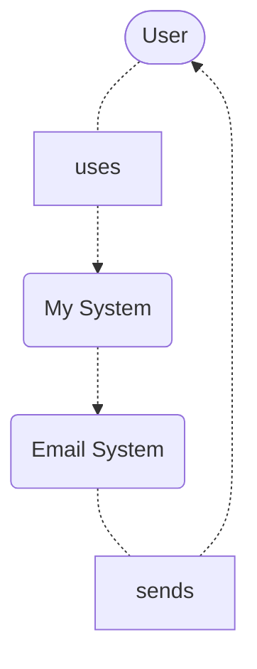
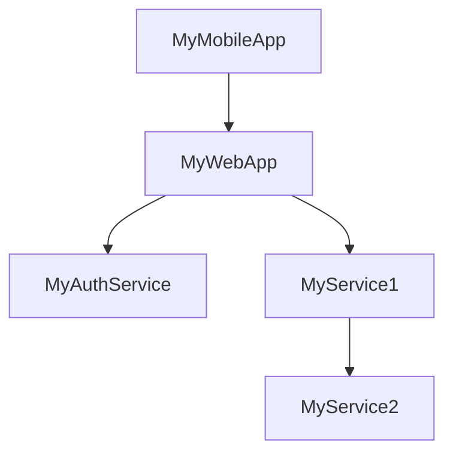
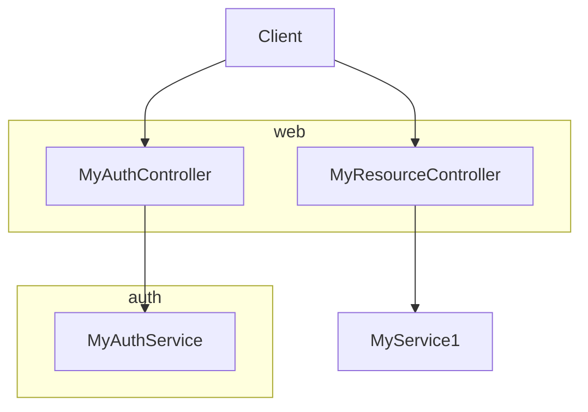
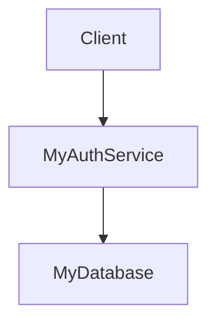
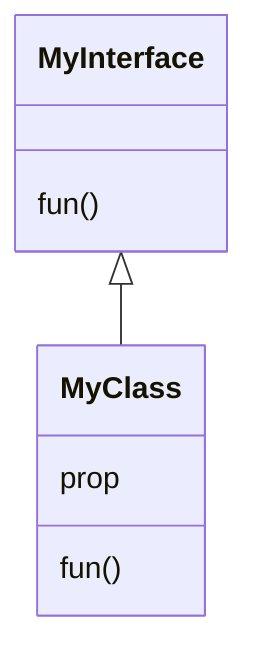

# System  diagram



# Container diagram (of MySystem)



# Component diagram (of MyWebApp)



# Component diagram (of MyAuthService)



# Code



```mermaid
sequenceDiagram
    A-->>B: message
    loop Every minute
        B-->>A: response
    end
 ```