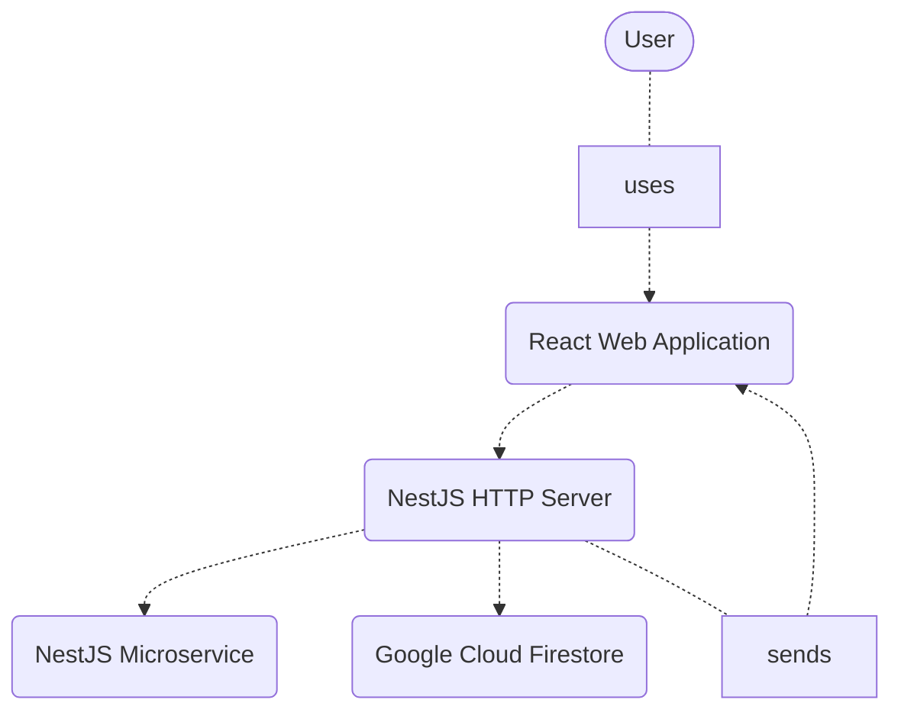
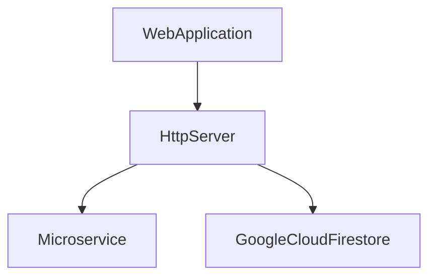
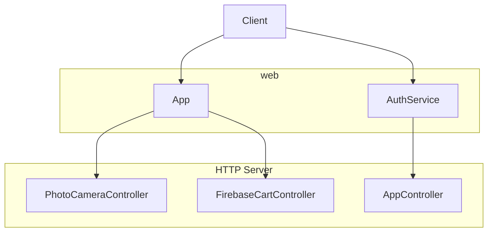
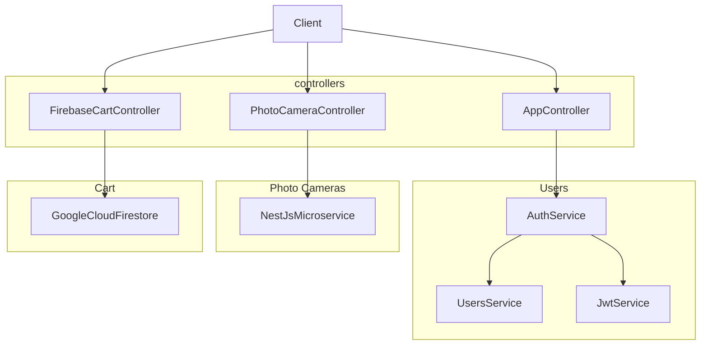
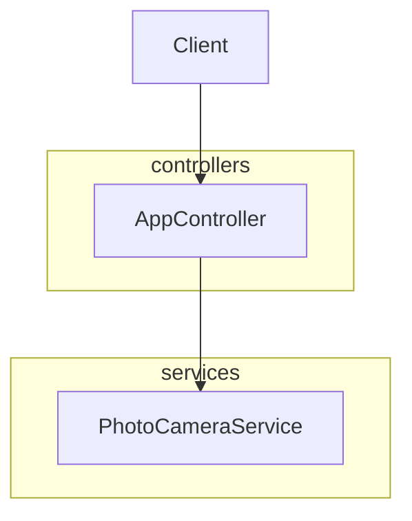
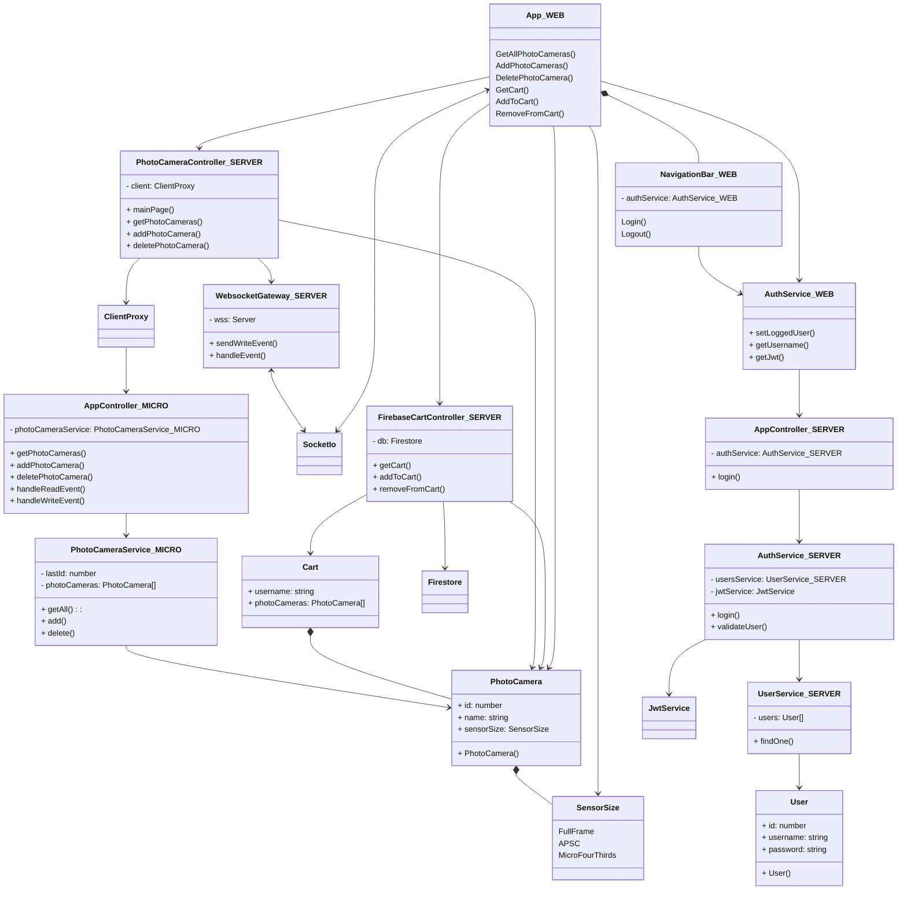

# Photo store application

## Technologies
- React Web Application _(application 1)_
- NestJS HTTP Server _(application 2)_
- NestJS Microservice _(application 3)_
- JWT authentication
- Google Cloud Firestore
- Socket.IO
- Docker

## Service-Oriented Architecture patterns
- REST services
- Microservices architecture
- JWT authentication and access
- Database as a Service (Google Cloud Firestore)
- Server-side notifications (Socket.IO WebSocket)

## Functionalities
- view all photo cameras in the store
- login _(hardcoded user 'Andrei' and password 'parola')_
- add photo camera
- delete photo camera
- view cart
- add photo camera to cart
- delete photo camera from cart 
_Note: Only the first 2 functionalities are public. For the others, the user must be authenticated._

## Run the applications
Run all the 3 applications with `npm start` and navigate to `http://localhost:3000`. 
Note: The server can be started in Docker with `docker-compose up`. See individual project's readme files for details.

## API
### React Web Application
Just navigate to `http://localhost:3000`.

### NestJS HTTP Server
REST API url: `http://localhost:3001`
- GET `/` and `/home` returns a basic welcome HTML page, respectively the json `{title: 'Photo camera store'}` 
- GET `/cameras` returns a `PhotoCamera[]` array
- POST `/cameras` with a `PhotoCamera` body adds the camera into the store and returns the created `PhotoCamera` (it will have an ID associated)
- DELETE `/cameras/:id` deletes the camera from the store and returns the deleted `PhotoCamera`
- POST `/login` with a `User` body authenticates the user and returns a JWT like `{"jwt": "Bearer abc123}`
- GET `/cart/:username` returns the user's `Cart`
- POST `/cart/:username` with a `PhotoCamera` body adds the camera to user's cart and returns the new `Cart`
- DELETE `/cart/:username` with a `PhotoCamera` body deletes the camera from user's cart (by ID) and returns the new `Cart`

**PhotoCamera**: object `{id: number; name: string; sensorSize: SensorSize;}` 
**SensorSize**: enum `[Fullframe, APSC, MicroFourThirds]` 
**User**: object `{id: number; username: string; password: string;}` 
**Cart**: object `{username: string; photoCameras: PhotoCamera[];}` 

## NestJS Microservice
Running on TCP `127.0.0.1:3002`
- Message `{ cmd: 'get-all' }` returns a `PhotoCamera[]` array
- Message `{ cmd: 'add' }` with a `PhotoCamera` as data adds the camera into the store and returns the created `PhotoCamera` (it will have an ID associated)
- Message `{ cmd: 'delete' }` with a `number` as data deletes the camera from the store and returns the deleted `PhotoCamera`
- Event `'read-event'` logs in console
- Event `'write-event'` logs in console

## Diagrams

Level 1:
### System diagram

Level 2:
### Container diagram

Level 3:
### Component diagram (of React Web Application)

### Component diagram (of NestJS HTTP Server)

### Component diagram (of NestJS Microservice)

Level 4:
### Code diagram
Node: Classes of _NestJS Microservice_ are suffixed with `_MICRO`, _NestJS HTTP Server_ with `_SERVER` and _React Web Application_ with `_WEB`.
